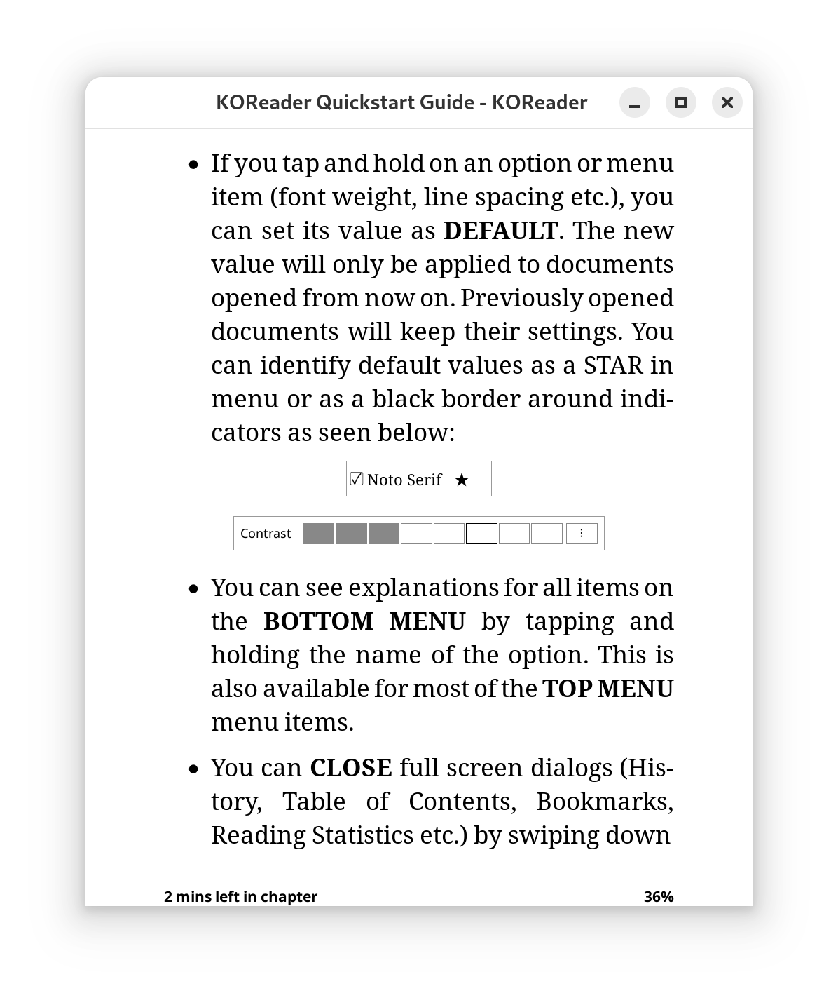

# Kindle-Style Status Bar for KOReader

A user patch that transforms KOReader's footer into a Kindle-like left/right justified layout with custom time remaining display.

## Features

- **Left/Right Layout**: Status items appear on the left, progress percentage on the right
- **Kindle-Style Time Display**: Shows "H hrs M mins left in chapter" format instead of "HH:MM"
- **Dynamic Margins**: Respects your document's left/right margin settings from the bottom menu

## Screenshots
- Applied patch with recommended settings:

## Requirements

- Device running KOReader version 2025-05-22 or later (tested on Kindle Paperwhite 4)

## Installation

1. Navigate to your KOReader installation directory
2. Create a `patches` folder if it doesn't exist
3. Copy `2-kindle-status-bar.lua` to the `patches` folder
4. Restart KOReader

## Configuration

For the most Kindle-like experience:

1. **Status Bar Items**:
   - Enable: Current page, Time left to finish book, Time left to finish chapter
   - Disable: "Show all selected items at once"
   
2. **Appearance Settings**:
   - Item font: "13, bold"
   - Item style: "Compact item symbols"
   - Item separator: "Vertical bar (|)" (important if using "Show all at once". Otherwise, all items will be left-justified)

3. **Usage**:
   - With "Show all at once" disabled, tap the footer to cycle through different status items, each item appearing on the left with progress percentage on the right
   - With "Show all at once" enabled, only the first item is left-aligned, and the rest will be right-aligned

## How It Works

The patch intercepts KOReader's footer rendering and:
- Splits text at the separator into left/right components
- Creates separate left and right text widgets with dynamic spacing
- Modifies time display functions to show Kindle-style formatting (X mins left in chapter)
- Dynamically handles margin updates when document settings change

## Known Limitations

- Designed to mimic this specific firmware (Kindle 5.16.2.1.1 (409754 002)), not the latest Paperwhite UI.
- Main focus of this patch is getting the "X mins left in chapter/book" aspect of the status bar right. Other details may be different than the Kindle version.

## Uninstall

Delete `2-kindle-status-bar.lua` from the patches folder and restart KOReader.
